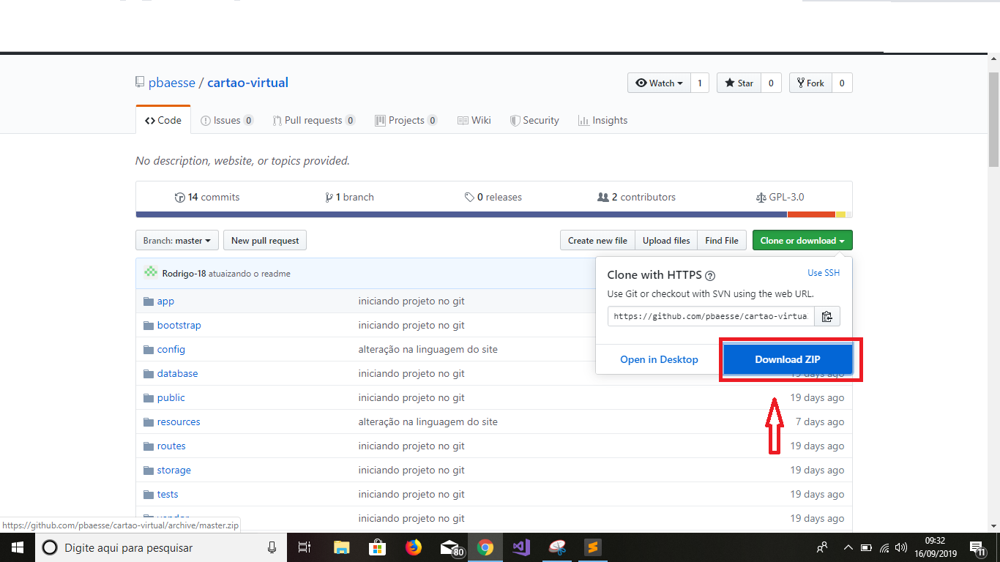
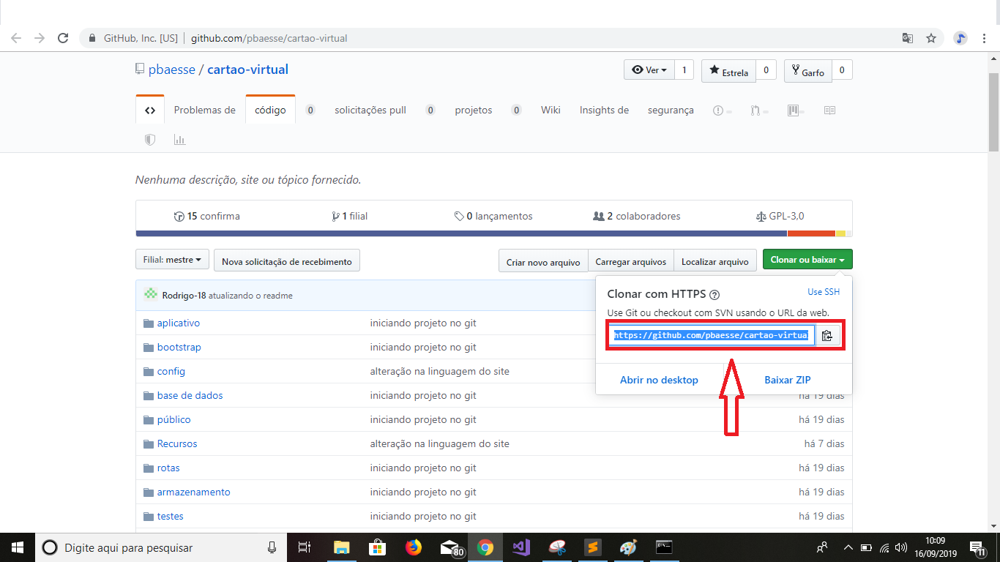
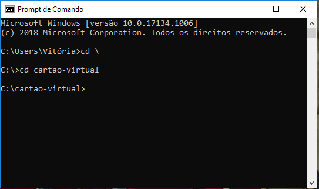
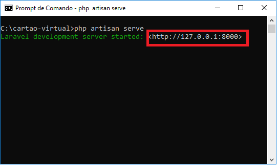
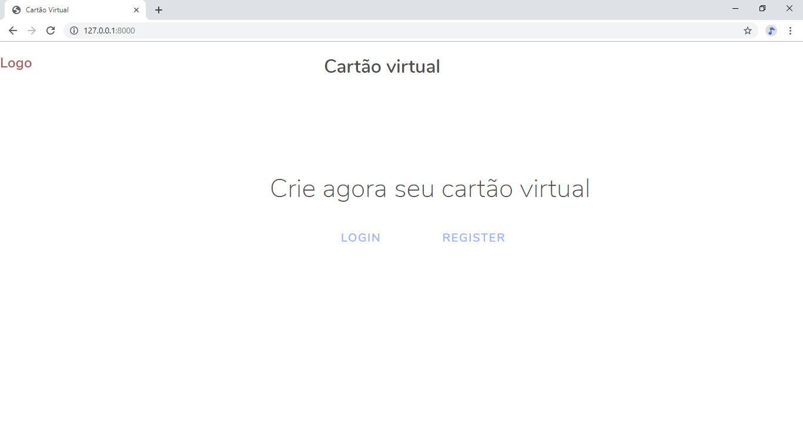

# Cartão Virtual

O projeto possui a capacidade de ajudar no armazenamento de dados
pessoais de cada cliente, de maneira virtual, através da criação de uma página
web.


## Pré-requisitos

O que você precisa ter instalado em sua máquina para rodar essa aplicação:

 
* O framework PHP livre e open-source <a href="https://laravel.com/docs/5.8">Laravel</a> > = 5.2 ;

* Um servidor local. Pode-se usar os dois mais conhecidos:
   * <a href="https://www.apachefriends.org/index.html?tmuid=5cd7132f358a1f59a91213eaff4525b2">XAMPP</a>

   * <a href="http://www.wampserver.com/en/">WAMPP</a>

   **Ambos vem com o PHP instalado com sua versão mais recente.**    


## Instalando

#### Primeiro você precisa baixar os arquivos do projeto que estão neste repositório. Temos duas possibilidades:

 
 1. Baixando o arquivo zipado pelo GitHub:

    Neste método precisa-se, apenas, clicar no botão "Clone or download" e clicar em "Download zip", como mostrado na imagem abaixo;
 
    
 
    Depois de baixado, extraia os arquivos no local que achar melhor.

    *OBS.: Precisa-se de um descompactador de dados, recomendamos o <a href ="https://www.7-zip.org/download.html/">7-zip</a>.*


 2. Clonando os arquivos:

    *OBS.: Por este método precisa-se ter o <a href="https://git-scm.com/downloads">Git</a> instalado em sua máquina.*

    Abra seu terminal, coloque no diretório onde deseja que fique a aplicação através do comando "cd" e, depois, digite o comando:

    ```
     git clone 
    ``` 

    Copie a url do repositório que se encontra no botão "clone or download":

    

    Agora é só colar, no terminal, depois do comando git clone:

    ```
    git clone https://github.com/pbaesse/cartao-virtual.git
    ```


### Agora vamos rodar a aplicação no navegador.

 1. Abra o terminal e entre na pasta que vc baixou. Tanto Windows quanto o Linux utilizam o comando 'cd', para o acesso de diretórios.

    


 2. Digite e, em seguida, execute o comando ```php artisan serve ```.

    Se tudo der certo, irá aparecer está tela:
    
    


 3. Basta copiar o endereço IP que apareceu na tela,

    

    colar na barra de endereço do seu navegador e executar.

    


#### Pronto, pode usufruir da aplicação!!


## Construído com

* [Laravel] (https://laravel.com/docs/5.8) - A estrutura da web usada


## Contribuindo

Leia [CONTRIBUTING.md] (CONTRIBUTING.md) para obter detalhes sobre nosso código de conduta e o processo para enviar solicitações pull para nós.

## Controle de versão

Usamos [Git] (https://git-scm.com/) para versionar. 

## Autores


* **Pedro Baesse** - *Engenharia de software* - [pbaesse] (https://github.com/pbaesse)

* **Rodrigo Soares** - *Desenvolvimento da aplicação* - [Rodrigo-18] (https://github.com/Rodrigo-18)

* **Ytalo Jhonata** - *Desenvolvimento da aplicação* - [ytalojhonata] (https://github.com/ytalojhonata)


## Licença

Este projeto está licenciado sob a LICENÇA PÚBLICA GERAL GNU - consulte o arquivo <a href ="LICENSE" target = "_blank">LICENSE</a> para obter detalhes.


